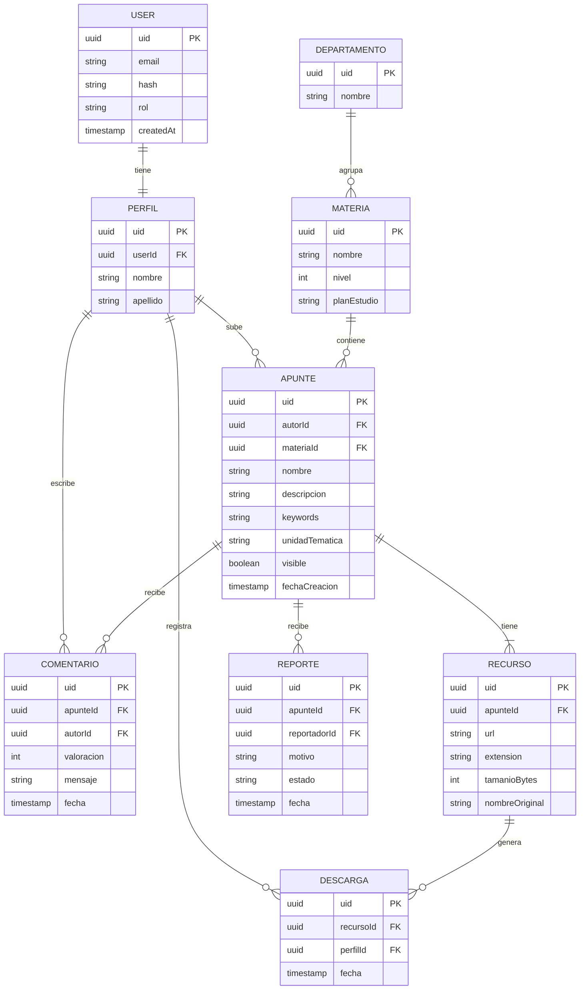
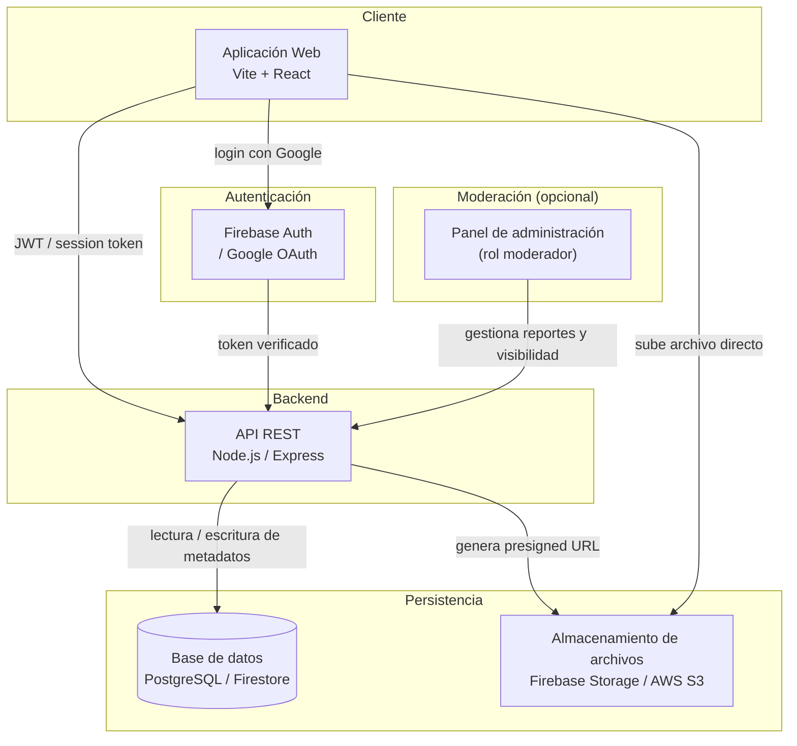

# Alcance

## Descripción general

El sistema es una plataforma web que permite a los estudiantes de las carreras dictadas en la UTN San Francisco subir, organizar, buscar y descargar apuntes correspondientes a las materias de cada plan de estudios. El objetivo principal es centralizar el material de estudio generado por la comunidad estudiantil, facilitando el acceso al conocimiento entre pares.

## Funcionalidades

### Gestión de Usuarios

1. Registro e inicio de sesión (opcional: con correo institucional (validación de dominio UTN)).
2. Perfil de usuario con historial de aportes y descargas.
3. Roles diferenciados: estudiante y moderador. (opcional)

### Gestión de apuntes

1. Subida de archivos en formatos PDF, DOCX e imágenes (JPG/PNG).
2. Categorización por carrera, año/nivel, materia y unidad temática.
3. Edición y eliminación de apuntes propios.
4. Descripción opcional y etiquetado por palabras clave.

### Búsqueda y navegación

1. Búsqueda por materia, carrera, palabra clave o autor.
2. Filtros por año de cursado, tipo de contenido y valoración.
3. Navegación jerárquica: carrera → materia → unidad.

### Valoración y reporte

1. Sistema de valoración por estrellas (1–5) sobre apuntes descargados.
2. Posibilidad de reportar contenido inapropiado o incorrecto. (opcional)

### Moderación (opcional)

1. Panel de moderación para revisión de reportes y gestión de contenido.
2. Posibilidad de ocultar o eliminar apuntes que incumplan las normas.

## Usuarios

| Actor      | Descripción                                                                      |
| ---------- | -------------------------------------------------------------------------------- |
| Estudiante | Usuario registrado que sube, busca y descarga apuntes                            |
| Moderador  | Estudiante con permisos extendidos para gestionar contenido reportado (opcional) |
| Visitante  | Usuario no registrado con acceso de solo lectura a la búsqueda                   |

## Arquitectura

1. Aplicación web responsiva, accesible desde navegador de escritorio y móvil.
2. Almacenamiento de archivos en servicio de almacenamiento en la nube (o una alternativa local) (por definir: Firebase Storage, AWS S3 u otro).
3. Autenticación mediante proveedor externo (Google/Firebase Auth).
4. Base de datos relacional o documental para metadatos de apuntes y usuarios.
5. Panel de administración básico accesible para moderadores. (Opcional)

## Restricciones y supuestos

1. Los apuntes son de autoría o propiedad del estudiante que los sube; la plataforma no valida derechos de autor más allá del reporte por parte de la comunidad.
2. El sistema no garantiza la exactitud o calidad académica del contenido subido.
3. El acceso estará limitado a estudiantes con correo institucional de UTN San Francisco, salvo que se decida habilitar registro abierto.
4. El tamaño máximo por archivo será definido según las restricciones del servicio de almacenamiento seleccionado.

# Diseño

## Diagrama Entidad-Relación (ER)

## Diagrama de Arquitectura

## Endpoints

### Autenticación

- `POST /auth/register` — registro con email y contraseña
- `POST /auth/login` — inicio de sesión
- `POST /auth/logout` — cerrar sesión
- `POST /auth/refresh` — renovar token

### Profile

- `GET /profile/me` — obtener perfil propio
- `PUT /profile/me` — editar perfil propio (nombre, apellido, carrera)
- `GET /profile/:uid` — ver perfil público de otro usuario
- `GET /profile/me/descargas` — historial de descargas propias
- `GET /profile/me/apuntes` — apuntes subidos por el usuario

### Departments

- `GET /department/all` — listar todos los departamentos
- `GET /department/:uid` — detalle de un departamento

### Subjects

- `GET /subject/all` — listar materias (con filtros: `?departamentoId=`, `?nivel=`)
- `GET /subject/:uid` — detalle de una materia
- `GET /department/:uid/subjects` — materias de un departamento específico

### Notes

#### Creación

- `POST /note` — crear apunte (nombre, descripción, keywords, materiaId, unidadTematica)
- `POST /note/:uid/resources/upload-url` — generar presigned URL(s) para subir archivos al storage
- `POST /note/:uid/resources` — confirmar y registrar los recursos una vez subidos

#### Consulta

- `GET /note/all` — listar apuntes (con filtros: `?materiaId=`, `?departamentoId=`, `?unidad=`, `?keyword=`, `?autorId=`, `?orden=valoracion|fecha|descargas`)
- `GET /note/:uid` — detalle de un apunte
- `PUT /note/:uid` — editar apunte propio (nombre, descripción, keywords, unidadTematica)
- `DELETE /note/:uid` — eliminar apunte propio

### Resources

- `GET /note/:uid/resources` — listar recursos de un apunte
- `GET /resource/:uid/download` — obtener URL firmada para descargar y registrar la descarga
- `DELETE /resource/:uid` — eliminar un recurso propio

### Comments

- `GET /apuntes/:uid/comment/all` — listar comentarios de un apunte
- `POST /apuntes/:uid/comment` — crear comentario (valoración + mensaje opcional)
- `PUT /comment/:uid` — editar comentario propio
- `DELETE /comment/:uid` — eliminar comentario propio

### Downloads

- `GET /profile/me/downloads` — historial de descargas (ya listado arriba)

### Moderación _(opcional)_

- `POST /note/:uid/report` — reportar un apunte
- `GET /moderation/report/all` — listar reportes pendientes
- `PUT /moderation/report/:uid` — resolver un reporte (estado: resuelto/descartado)
- `PUT /moderation/note/:uid/visibility` — ocultar o mostrar un apunte
